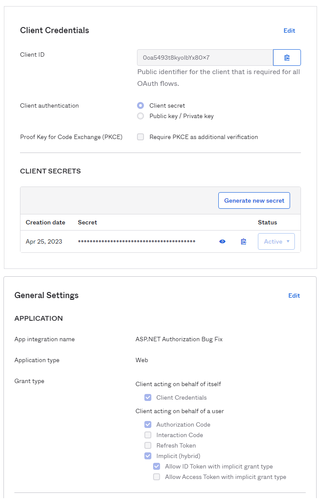

# ASP.NET MVC + Okta Authorization Bug Fix

## Introduction

This example is based on the Okta ASP.NET MVC example at https://github.com/oktadev/okta-aspnet-mvc-example
which uses .NET Framework 4 (not Core).
The instructions in that project to configure and run apply to this project.

The problem symptoms are that when a controller method is annotated with *[Authorize]* and the user
is not authorized, the browser is repeatedly redirected for authorization but the IdP (Okta)
has a session for the user and sends them right back, where the application again redirects
for authentication creating an infinite loop..

The root of the problem is that .NET Framework is returning an HTTP 401 instead of an HTTP 403 when
the user is not authorized.
This is in line with the HTTP standard prior to 2014.
It was recognized as a problem because 401 had a double meaning (unauthenticated or unauthorized) and
was changed in the standard.
Current browser follow the current standard, and treat 403 as unauthorized and 401 as unauthenticated.
Because of this, the 401 returned by framework 4 causes a loop trying to reauthenticate.

The best solution is to override the implementation of the *AuthorizeAttribute* class
and return an HTTP 403 instead of the 401!

## Program Tour

### Configuration

The web.config file has been configured to communicate with an Okta
application integration that uses OIDC with a Client ID and Secret.
The application still uses "implicit" flow because that is how the
example was built.

The Okta application configuration:



### The Problem

The problem was reproduced in this example by adding a *Secured* view and
a link on the menu on the Home page with the corresponding controller method.
In the controller the method has the *Authorize* annotation added:

```
[Authorize(Roles = "NobodyHasThisRole")]
public ActionResult Secured() {
```

If our changes were stopped here, the program executed, and the user clicks
on the *Secured* item on the Home page then the infinite loop starts.

### The Solution - Override AuthorizeAttribute

AuthorizeAttribute.cs is in the controllers folder alongside of HomeController.cs,
so the controller uses it (closer) instead of the one in System.Web.Mvc.
The *HandleUnauthorizedRequest* method is overridden to return HTTP 403:

```
[AttributeUsage(AttributeTargets.Class | AttributeTargets.Method, Inherited = true, AllowMultiple = true)]
public class AuthorizeAttribute : System.Web.Mvc.AuthorizeAttribute {
    protected override void HandleUnauthorizedRequest(System.Web.Mvc.AuthorizationContext filterContext) {
        if (filterContext.HttpContext.Request.IsAuthenticated) {
            filterContext.Result = new System.Web.Mvc.HttpStatusCodeResult((int)System.Net.HttpStatusCode.Forbidden);
        } else {
            base.HandleUnauthorizedRequest(filterContext);
        }
    }
}
```

With this in place the page request is rejected because the user isn't authorized.

## Links

* [ASP.NET + Okta authentication quickstart](https://developer.okta.com/quickstart/#/okta-sign-in-page/dotnet/aspnet4)
* Use the [Okta .NET SDK](https://github.com/okta/okta-sdk-dotnet) if you need to call [Okta APIs](https://developer.okta.com/docs/api/resources/users) for management tasks

## License

Apache 2.0, see [LICENSE](LICENSE).
